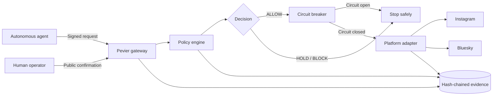

<div align="center">
  

  # Pevier

  **The policy firewall for autonomous social media.**

  Pevier evaluates every publishing request, stops unsafe actions, and records tamper-evident evidence before a connected social platform receives anything.

  [Live product](https://pevier.vercel.app) · [Report an issue](https://github.com/webski101/pevier/issues)

  
  
  
  
</div>

---

## Why Pevier exists

Autonomous agents can generate and publish content faster than a human can review it. The dangerous part is not content generation—it is giving an agent an unrestricted path to a public account.

Pevier is the control plane between an agent and a social platform. It gives every request the same enforceable path:

1. Authenticate the requesting user or agent.
2. Evaluate the content against portfolio policy.
3. Calculate a deterministic risk score.
4. Return an `ALLOW`, `HOLD`, or `BLOCK` decision.
5. Check the relevant circuit breaker.
6. Require explicit operator confirmation for a public write.
7. Record the decision in a SHA-256 hash-linked audit chain.

The social OAuth credential stays inside Pevier. Publishing agents never receive it.

## How it works



### Decisions

| Decision | Meaning | Platform write |
| --- | --- | --- |
| `ALLOW` | The request passed the active policy set. | Only in Live mode with explicit confirmation. |
| `HOLD` | The request needs operator review or remediation. | Never. |
| `BLOCK` | The request violates a blocking policy or circuit state. | Never. |

### Publishing modes

| Mode | What Pevier does | What the platform receives |
| --- | --- | --- |
| **Dry run** | Runs the full policy decision and saves evidence. | Nothing. |
| **Live public** | Runs the same checks, then requires a deliberate confirmation. | Only an approved publication. |

Every new social connection starts in **Dry run**.

## What is live today

| Capability | Status | Notes |
| --- | --- | --- |
| Google identity sign-in | Live | Uses only `openid`, `email`, and `profile`; no YouTube permission. |
| Instagram Reels | Live | Business or Creator accounts through Instagram Login. |
| Bluesky text posts | Live | Account-owned OAuth with PKCE and DPoP; no app password stored. |
| Policy previews | Live | Real evaluation and evidence with no external write. |
| Public publishing | Live | Requires `ALLOW`, a closed circuit, Live mode, and operator confirmation. |
| Per-user isolation | Live | Social connections, tokens, records, and agent keys are owner-scoped. |
| Audit verification | Live | SHA-256 hashes and chronological links can be verified from the UI. |
| YouTube | Coming soon | The previous experimental adapter is intentionally disabled. |
| X / Twitter | Coming soon | Planned policy-gated adapter. |

## Product highlights

- **Authenticated control room** — signed-out visitors cannot access platform settings, user data, or publication history.
- **Deterministic policy engine** — transparent risk signals and repeatable decisions instead of an opaque model verdict.
- **Scoped circuit breakers** — stop an agent, channel, platform, portfolio, or all live publishing.
- **Tamper-evident audit log** — every important transition links to the previous record and can be independently verified.
- **Encrypted social credentials** — access tokens and Bluesky OAuth sessions are encrypted at rest with an application key.
- **Production agent bridge** — account-scoped API keys let external agents request evaluation without seeing OAuth secrets.
- **Temporary media handoff** — Reel videos use Vercel Blob only long enough for Meta to import them, then Pevier removes the temporary object.
- **Fail-closed adapters** — validation, policy, authorization, processing, or upstream failures stop safely and produce evidence.

## Technology

| Layer | Implementation |
| --- | --- |
| Web application | Next.js 15 App Router, React 19, TypeScript |
| Interface | Tailwind CSS 4, custom design tokens, Phosphor Icons, GSAP |
| Validation | Zod |
| Data | Prisma with SQLite locally and PostgreSQL in production |
| Instagram | Instagram API with Instagram Login |
| Bluesky | AT Protocol OAuth, PKCE, DPoP, `@atproto` SDKs |
| Media transfer | Vercel Blob |
| Deployment | Vercel |
| Testing | Vitest, ESLint, production Next.js build |

## Run locally

### Requirements

- Node.js 20 or newer
- npm
- A Google OAuth web client for login
- Optional Instagram and Bluesky credentials for platform testing

### 1. Clone and install

```bash
git clone https://github.com/webski101/pevier.git
cd pevier
npm install
```

### 2. Create the local environment

```powershell
Copy-Item .env.example .env
```

On macOS or Linux:

```bash
cp .env.example .env
```

At minimum, configure Google sign-in and generate a 32-byte encryption key:

```bash
node -e "console.log(require('crypto').randomBytes(32).toString('base64'))"
```

It is normal for the generated key to end with `=`. Keep `.env` private and never commit it.

### 3. Start Pevier

```bash
npm run dev
```

Open [http://localhost:3000](http://localhost:3000). The `predev` script generates the Prisma client, prepares the local SQLite database, and seeds a new workspace when needed.

## Environment variables

The complete template lives in [`.env.example`](./.env.example).

| Variable | Required | Purpose |
| --- | --- | --- |
| `DATABASE_URL` | Yes | SQLite locally; hosted PostgreSQL in production. |
| `PEVIER_ENCRYPTION_KEY` | Yes | Base64-encoded 32-byte key for encrypting social credentials. |
| `PEVIER_PUBLISH_MODE` | Yes | Global default; use `DRY_RUN` for safe setup. |
| `GOOGLE_AUTH_CLIENT_ID` | Yes | Google OAuth web-client ID for Pevier login. |
| `GOOGLE_AUTH_CLIENT_SECRET` | Yes | Google OAuth web-client secret. |
| `GOOGLE_AUTH_REDIRECT_URI` | Yes | `/api/auth/google/callback` on the current origin. |
| `INSTAGRAM_APP_ID` | Instagram | Instagram application ID. |
| `INSTAGRAM_APP_SECRET` | Instagram | Instagram application secret. |
| `INSTAGRAM_REDIRECT_URI` | Instagram | `/api/platforms/instagram/callback` on the current origin. |
| `INSTAGRAM_API_VERSION` | Instagram | Meta Graph API version; defaults to the value in `.env.example`. |
| `BLOB_READ_WRITE_TOKEN` | Instagram Live | Vercel Blob token for short-lived Reel transfer. |
| `BLUESKY_PUBLIC_URL` | Bluesky | Canonical public origin used in OAuth metadata. |
| `BLUESKY_OAUTH_PRIVATE_KEY` | Bluesky | ES256 private key used to authenticate the OAuth client. |
| `PEVIER_ACCOUNT_KEY` | Agent CLI | Account key created in **Settings → Publisher bridge**. |
| `PEVIER_AGENT_ID` | Agent CLI | Owner-scoped publishing agent ID. |
| `PEVIER_CHANNEL_ID` | Agent CLI | Owner-scoped destination channel ID. |

## Configure platform access

### Google login

Create a Google OAuth **Web application** and request only:

```text
openid
https://www.googleapis.com/auth/userinfo.email
https://www.googleapis.com/auth/userinfo.profile
```

For local development, register:

```text
http://localhost:3000/api/auth/google/callback
```

For production, register:

```text
https://pevier.vercel.app/api/auth/google/callback
```

Google login establishes the Pevier browser session. It does not request YouTube access and Pevier does not store a Google access token.

### Instagram

Configure **Instagram API with Instagram Login** and use:

```text
http://localhost:3000/api/platforms/instagram/callback
https://pevier.vercel.app/api/platforms/instagram/callback
```

Instagram publishing requires a **Business or Creator** account. Personal accounts cannot use Meta's publishing API. Users outside the app's assigned roles require the Meta app to be published with the necessary permissions and Advanced Access.

### Bluesky

Bluesky uses public client metadata and an ES256 signing key. Users authorize Pevier directly through their own AT Protocol account; Pevier never asks for or stores their password.

## Connect an autonomous agent

1. Sign in to Pevier.
2. Open **Settings → Publisher bridge**.
3. Create an account API key and store it in the agent's secret manager.
4. Copy the owner-scoped agent and channel IDs.
5. Submit a request through the gateway.

The bundled CLI accepts real post metadata:

```bash
npm run agent:publish -- "Post title" "Post content"
```

The agent calls `POST /api/publish`. It can request an evaluation, but it cannot read social OAuth credentials or confirm a public platform write.

## API surface

| Area | Endpoints |
| --- | --- |
| Authentication | `GET /api/auth/google/connect`, `GET /api/auth/google/callback`, `POST /api/auth/logout` |
| Agent access | `GET/POST/DELETE /api/agent-credentials`, `POST /api/publish` |
| Control plane | `GET /api/status`, `GET /api/portfolio`, `GET /api/posts` |
| Policies and safety | `GET/PATCH /api/policies`, `POST /api/circuit-breaker`, `GET /api/incidents` |
| Evidence | `GET /api/audit` |
| Instagram | `GET/PATCH/DELETE /api/platforms/instagram`, connect/callback, upload, and publish routes |
| Bluesky | `GET/PATCH/DELETE /api/platforms/bluesky`, OAuth metadata/callback, and publish routes |

There are no active YouTube or X OAuth/publishing endpoints in this release.

## Verify the project

```bash
npm test
npm run lint
npm run build
```

The current suite covers policy decisions, risk scoring, similarity checks, circuit breakers, gateway behavior, authentication boundaries, secret encryption, and audit-chain verification.

## Deploy to Vercel

1. Import the repository into Vercel.
2. Provision a PostgreSQL database and set `DATABASE_URL`.
3. Add the production environment variables from the table above.
4. Connect a public Vercel Blob store when enabling Instagram Live publishing.
5. Add the production callback URLs to Google and Meta.
6. Deploy and test first in Dry run mode.

The canonical deployment is [pevier.vercel.app](https://pevier.vercel.app).

## Public-access checklist

The code supports separate user accounts and owner-scoped social connections. Unrestricted external use also depends on the platform consoles:

- Set the Google OAuth audience to **External / In production** and complete any required domain verification.
- Publish the Meta app and obtain the permissions or Advanced Access required for Instagram users outside the app's assigned roles.
- Test login, connection, Dry run, Live confirmation, emergency stop, and disconnect using a second person's account.
- Keep production secrets only in Vercel and rotate any credential that has been exposed elsewhere.

## Safety statement

Pevier provides automated policy enforcement, risk signals, and evidence. It does not replace human editorial judgment, legal review, or compliance with each platform's terms. Final responsibility for a public publication remains with the operator.

---

<div align="center">
  <strong>Pevier</strong><br />
  Policy before publishing. Evidence after every decision.
</div>
